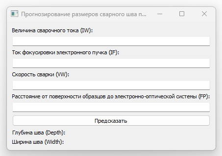

**Создание окружения:**

- **Клонировать репозиторий**

_git clone git@github.com:ivan-varyukhin/BMSTU-svarka.git_

- **Перейти в директорию приложения**

_cd BMSTU-svarka_

- **Создать виртуальное окружение**

_python3 -m venv venv_

- **Активировать виртуальное окружение**

_. ./venv/bin/activate_

- **Обновить установщик пакетов**  **pip**

_pip install --upgrade pip_

- **Установить зависимости**

_pip install -r requirements.txt_

**Запуск приложения:**

_python3 main.py_

**Структура приложения:**

_main __.__ py_ – основной файл приложения
_requirements__._txt – файл зависимостей
_model __.__ pkl_ – модель, осуществляющая прогноз

_lr __\___ model __.__ ipynb_ – ноутбук с исследованием исходных данных и разработкой модели

_/ __dataset__ /_ - каталог с исходным датасетом, использованным для обучения модели

**Работа в приложении:**

Приложение было разработано на Python в GUI-варианте.

Пользователю необходимо ввести параметры сварки и нажать кнопку «Предсказать».

В результате пользователю будут выданы прогнозные значения глубины и ширины шва сварного соединения.

**Дополнительно:**

Для улучшения удобства использования приложения пользователем, можно упаковать код на Python и все зависимости в один исполняемый файл. Например, можно использовать PyInstallerили аналогичные инструменты.

- **Установить PyInstaller**

_pip install pyinstaller_

- **Преобразовать код Python в исполняемый файл**

_pyinstaller --noconfirm --onefile --windowed --collect-submodules "sklearn" "main.py"_

После выполнения этой команды, pyinstaller создаст каталог, где будет содержаться ваш исполняемый файл.

