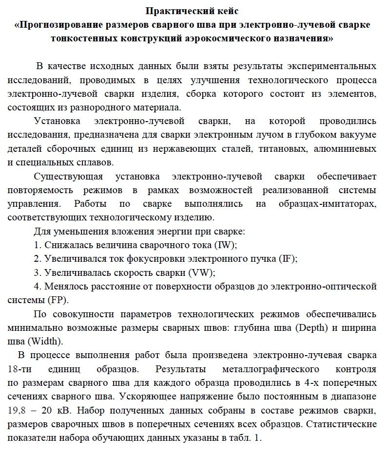
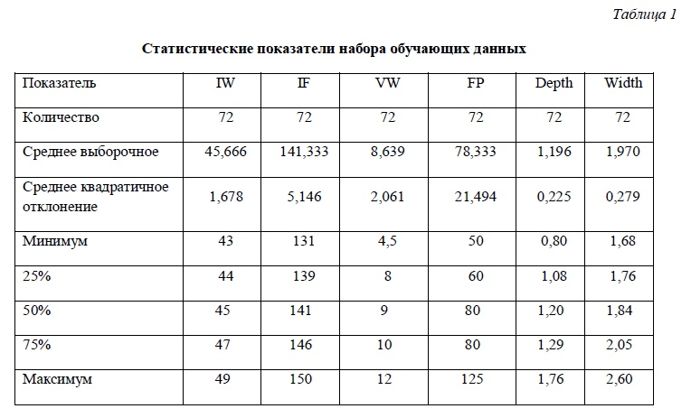

## Создание окружения: ##

- **Клонировать репозиторий**

```
git clone git@github.com:ivan-varyukhin/BMSTU-svarka.git
```

- **Перейти в директорию приложения**

```
cd BMSTU-svarka
```

- **Создать виртуальное окружение**

```
python3 -m venv venv
```

- **Активировать виртуальное окружение**

```
./venv/bin/activate
```

- **Обновить установщик пакетов**  **pip**

```
pip install --upgrade pip
```

- **Установить зависимости**

```
pip install -r requirements.txt
```

## Приложение: ##

**Запуск приложения**

```
python3 main.py
```


**Структура приложения**

```
main.py             # основной файл приложения
requirements.txt    # файл зависимостей
model.pkl           # модель, осуществляющая прогноз
lr_model.ipynb      # ноутбук с исследованием исходных данных и разработкой модели
/dataset/           # каталог с исходным датасетом, использованным для обучения модели
```

**Работа в приложении**

Приложение было разработано на Python в GUI-варианте.


Пользователю необходимо ввести параметры сварки и нажать кнопку «Предсказать».

В результате пользователю будут выданы прогнозные значения глубины и ширины шва сварного соединения.

## Дополнительно: ##

Для улучшения удобства использования приложения пользователем, код на Python и все зависимости соберем в один исполняемый файл.

- **Установить PyInstaller**

```
pip install pyinstaller
```

- **Преобразовать код Python в исполняемый файл**

```
pyinstaller --noconfirm --onefile --windowed --collect-submodules "sklearn" "main.py"
```


